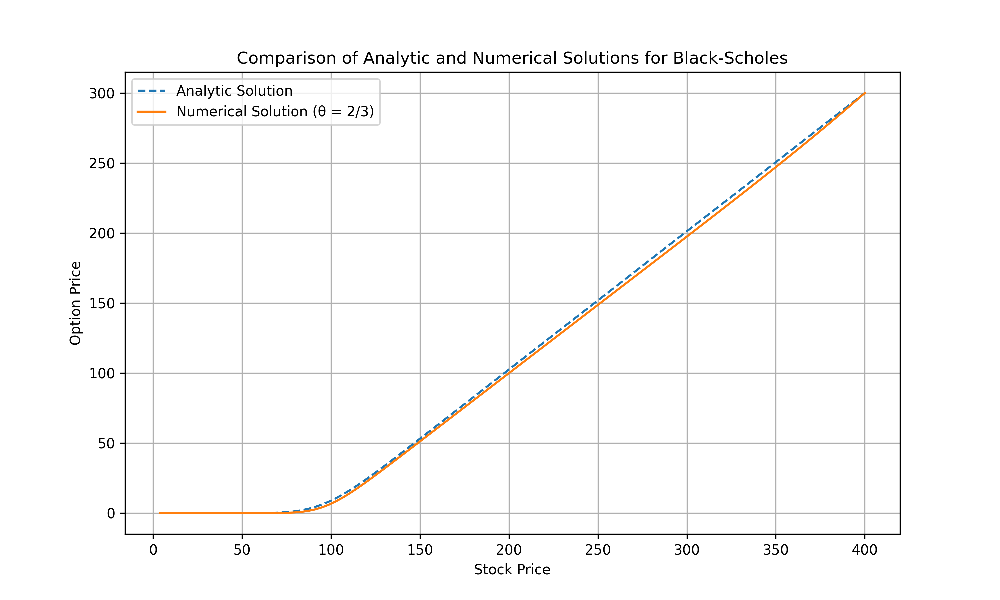
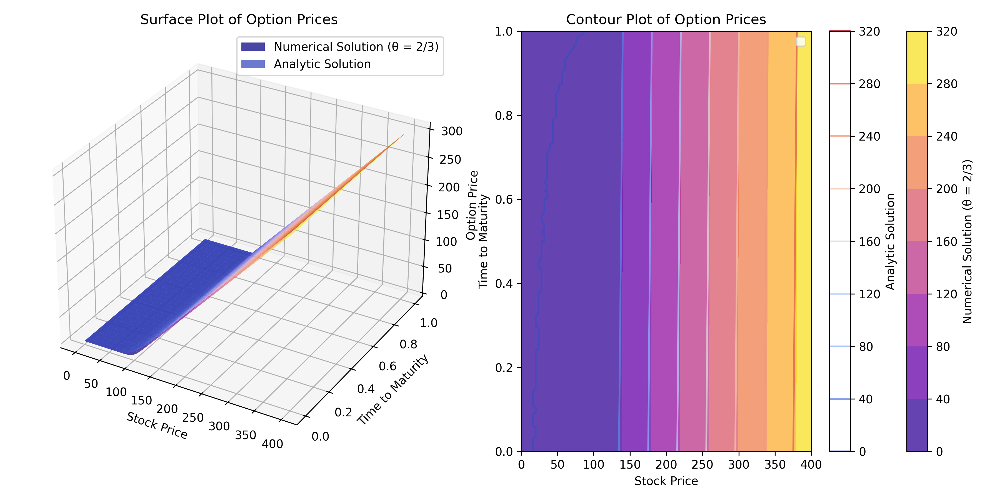
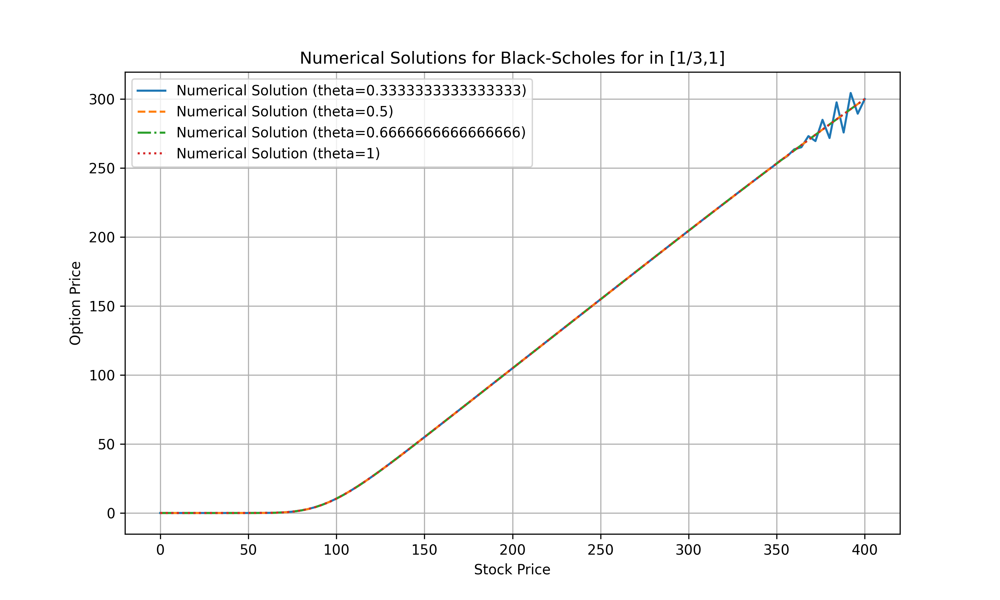

# Black-Scholes Option Pricing: Crank–Nicolson Method

## Introduction  
The **Black–Scholes model** is a mathematical framework for pricing European-style options. It was developed under specific assumptions to simplify the pricing problem:  

- Markets are frictionless (no transaction costs or taxes).  
- Trading of the underlying asset is continuous.  
- The risk-free interest rate and volatility of the underlying asset are constant over time.  
- The underlying asset follows **geometric Brownian motion** with log-normally distributed returns.  
- No dividends are paid during the life of the option.  
- Markets are efficient (no arbitrage opportunities).  

Under these assumptions, the Black–Scholes equation provides an **analytic (closed-form)** solution for option prices. However, in many cases, especially when assumptions are violated, **numerical methods** are necessary. This project implements the **Crank–Nicolson method**—a fractional step scheme that blends **Forward-Time Central-Space (FTCS)** and **Backward-Time Central-Space (BTCS)** methods—for discretizing and solving the Black–Scholes partial differential equation given below:

`∂V/∂t + (1/2)σ²S² ∂²V/∂S² + rS ∂V/∂S − rV = 0`
where:
- **V(S, t)** — Price of the option as a function of stock price **S** and time **t**.  
- **S** — Underlying asset (stock) price.  
- **t** — Time (with maturity at **T**).  
- **σ** — Volatility of the stock’s returns.  
- **r** — Risk-free interest rate.  
- **∂V/∂t** — Change in option value with respect to time.  
- **∂V/∂S** — First derivative of option value with respect to the stock price (*Delta*).  
- **∂²V/∂S²** — Second derivative of option value with respect to the stock price (*Gamma*).  
---

## Section 1 : Analytical vs Numerical Solution
### 1.1 1D plot



- The numerical solution closely follows the analytic solution, showing that the fractional step Crank–Nicolson method provides accurate approximations for stock prices

### 1.2 : 3D and 2D Contour Plot for Analytical vs Numerical Solution


#### 3D plot (left) 
- Axes:

     - x-axis (Stock Price): Ranges from 0 to 400.

     - y-axis (Time to Maturity): Ranges from 0 (present) to 1 year (maturity).

     - z-axis (Option Price): Shows the computed option price values.

- Blue surface: Represents the numerical solution of the Black–Scholes partial differential equation using θ = 2/3.

- Orange line: Represents the analytic (exact) Black–Scholes solution for the same parameters.

- Observation: The numerical surface closely follows the analytic solution, showing that the fractional step Crank–Nicolson method provides accurate approximations across both stock prices and time steps.

#### 2D plot (right)
- Axes:
  - x-axis (Stock Price): Same range as above.

  - y-axis (Time to Maturity): From 0 to 1 year.

- Filled contours (purple–yellow): Show option price levels computed from the numerical solution.

- Thin contour lines (white–orange): Represent the analytic solution levels for direct comparison.

**Color bars:**

- Rightmost bar labeled “Numerical Solution (θ = 2/3)” shows the price levels for the filled contours.

- Left bar labeled “Analytic Solution” corresponds to the thin contour lines.

- Observation: The contour lines (analytic) align closely with the filled regions (numerical), reinforcing that the θ = 2/3 scheme provides excellent stability and accuracy.

- The Crank–Nicolson–based fractional step method (θ = 2/3) successfully approximates the analytic Black–Scholes prices

### General Observation
- All plots confirm that for different stock prices and times to maturity, the numerical approach produces results nearly identical to the exact solution (analytic) using the Crank–Nicolson–based fractional step method (θ = 2/3)
---

---
## Section 2 : Numerical Solution for multiple values of theta


### Insights

- For most of the stock price range (0–300), all numerical methods produce almost identical results, showing the stability and accuracy of these schemes for European option pricing.

- Differences at High Stock Prices:

  - Near S > 350, the θ = 1/3 (blue) line begins to oscillate and deviate slightly from the others. This is because  θ < 1/2 is closer to the explicit method which is conditionally stable

- Stability of Crank–Nicolson and Backward Euler:

  - The θ = 0.5 (Crank–Nicolson), θ = 2/3, and θ = 1 (fully implicit) solutions remain smooth and well-behaved, even at higher stock prices.

- Crank–Nicolson provides a good balance between accuracy and stability, making it the preferred choice.

---
---
## Section 2 : Error Analysis 
This section performs an error analysis of the Black–Scholes option pricing model. It calculates European call option prices using two methods:
 - (1) the analytic Black–Scholes formula (exact solution)
 - (2) a fractional step θ-method with Crank–Nicolson for two θ values (1/3 and 1).
 It then compares the numerical results to the analytic solution by computing the absolute error for each stock price. 
 The results—including stock prices, analytic values, numerical solutions for both θ values, and their respective errors—are organized into a pandas DataFrame.
- The last 5 rows can be seen in the table below


| Index | Stock Price | Analytical Solution | Numerical Solution (θ = 1/3) | Numerical Solution (θ = 1) | Error (θ = 1/3) | Error (θ = 1) |
|-------|-------------|--------------------|------------------------------|----------------------------|----------------|---------------|
| 96    | 384.0       | 284.199800         | 297.581825                   | 285.299295                 | 13.382024      | 1.099495      |
| 97    | 388.0       | 288.149888         | 275.735472                   | 288.998237                 | 12.414415      | 0.848349      |
| 98    | 392.0       | 292.099950         | 304.356209                   | 292.681423                 | 12.256259      | 0.581473      |
| 99    | 396.0       | 296.049988         | 289.371870                   | 296.348714                 | 6.678117       | 0.298726      |
| 100   | 400.0       | 300.000000         | 300.000000                   | 300.000000                 | 0.000000       | 0.000000      |

### 📝 Interpretation
- **Analytical Solution**: The exact Black–Scholes price for a European call option.  
- **Numerical Solutions**: Values obtained using the fractional step θ-method for θ = 1/3 and θ = 1.  
- **Error Columns**: Show the **absolute difference** between the analytical and numerical results.  
- Smaller error values (as seen for θ = 1) indicate **higher accuracy** of the numerical scheme compared to the analytical benchmark.  
- For higher stock prices, the numerical solutions with **θ = 1** are much closer to the analytical solution, confirming the **stability and accuracy** of the Crank–Nicolson method.
---

## Real-World Applications

- Although the idealized assumptions of Black–Scholes rarely hold perfectly, this model—and its numerical implementations—are widely used in finance:

- Equity and index options pricing: Traders benchmark against Black–Scholes before applying volatility adjustments.

- Risk management: Firms estimate option sensitivities (“Greeks”) to manage hedging strategies.

- Exotic options and derivatives: When no closed-form solution exists (e.g., American, barrier, or path-dependent options), numerical PDE methods like Crank–Nicolson are indispensable.

- Algorithmic trading: Numerical approximations support fast pricing in high-frequency environments.

---
## Usage

Open the Jupyter Notebook and run all cells

---
## Requirements  
Install dependencies before running the notebook:  
```bash
pip install numpy matplotlib scipy
